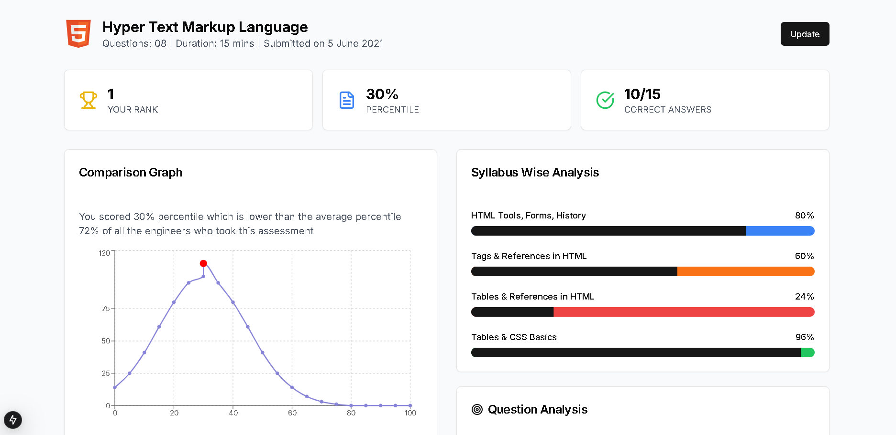

# HTML Assessment Dashboard

A responsive dashboard built for Cuvette Tech's assessment platform, showcasing student performance in HTML assessments with interactive visualizations and real-time updates.



## Features

### 1. Interactive Performance Metrics

- Real-time rank tracking
- Percentile comparison
- Score visualization
- Dynamic updates through modal interface

### 2. Detailed Analysis

- **Comparison Graph**

  - Bell curve distribution
  - Visual percentile comparison
  - Interactive data points
  - Highlighted user position

- **Syllabus-wise Analysis**

  - Topic-wise progress tracking
  - Color-coded progress bars
  - Responsive layout
  - Performance indicators

- **Question Analysis**
  - Circular progress visualization
  - Score breakdown
  - Performance feedback
  - Color-coded indicators

### 3. Responsive Design

- Mobile-first approach
- Tablet and desktop optimized
- Flexible grid layouts
- Adaptive content sizing

### 4. Input Validation

- Score range validation (0-15)
- Percentile range checks (0-99)
- Rank validation
- Error feedback

## Tech Stack

- Next.js 14
- TypeScript
- Tailwind CSS
- Shadcn/ui Components
- Recharts
- React Circular Progressbar

## Getting Started

1. **Clone the repository**

```bash
git clone https://github.com/Priyanshuraj21030/Dashboard.git
```

2. **Install dependencies**

```bash
npm install
```

3. **Run the development server**

```bash
npm run dev
```

## Project Structure

```
project/
├── app/
│   ├── page.tsx        # Main dashboard component
│   └── layout.tsx      # Root layout
├── components/
│   └── ui/            # Reusable UI components
├── public/            # Static assets
└── styles/           # Global styles
```

### Requirements

```bash
npm install
npm install next@latest
npm install recharts
npm install react-circular-progressbar
npm run dev

## Acknowledgments

- Design inspiration from Cuvette Tech
- Built with [Next.js](https://nextjs.org/)
- UI components from [shadcn/ui](https://ui.shadcn.com/)
- Charts powered by [Recharts](https://recharts.org/)
```